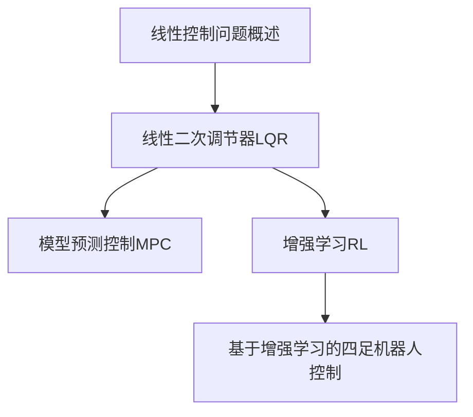

# OptimalControl-RL_abstract

机器人第四次培训：最优控制与增强学习理论部分与简单案例。  

从简单控制问题讲解到线性最优控制（LQR），扩展到模型预测控制（MPC），最有讲解增强学习控制算法以及在机器人控制上的应用  

```mermaid
graph TD
A[线性控制问题概述] --> B[线性二次调节器LQR]
B --> C[模型预测控制MPC]
B --> D[增强学习RL]
D --> E[基于增强学习的四足机器人控制]
```

