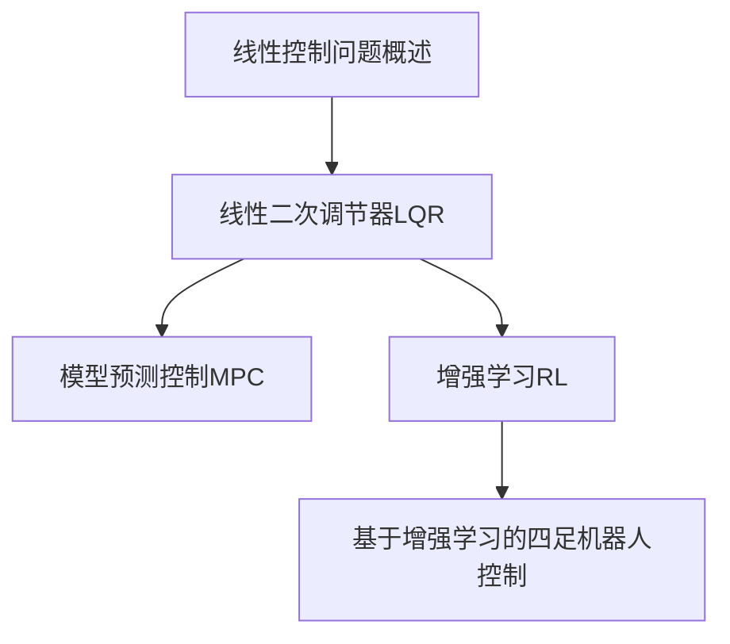
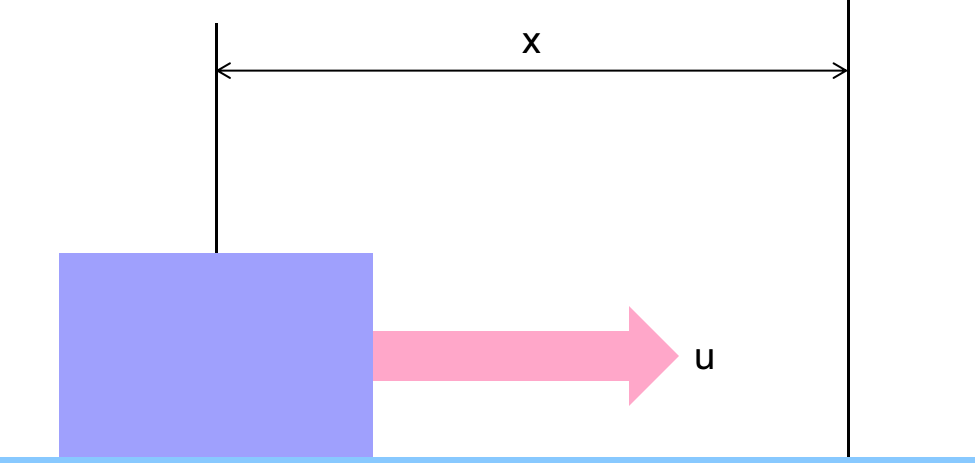
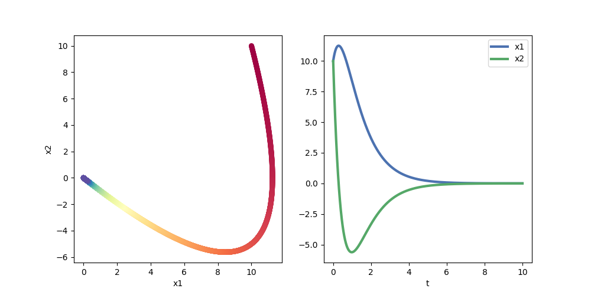
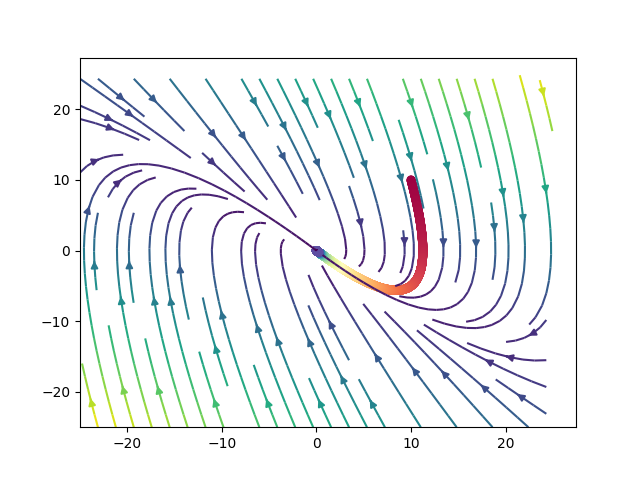
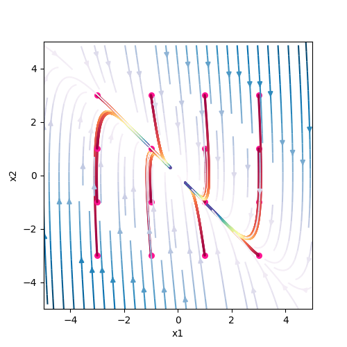
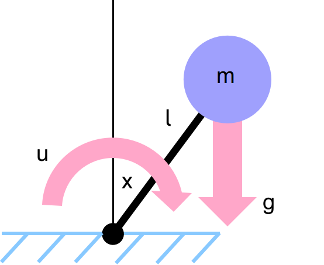
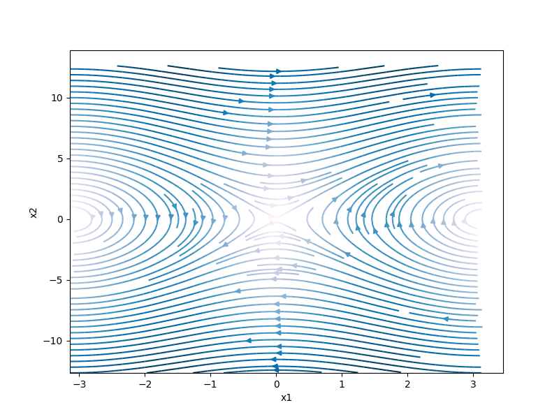
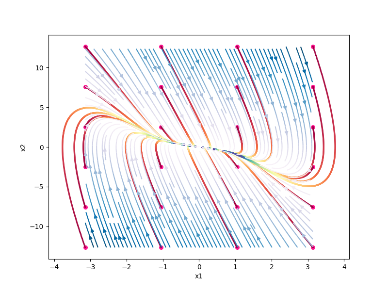
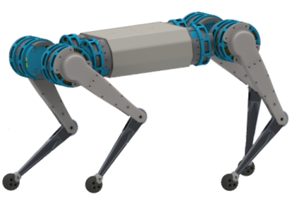

## 第四次培训：最优控制与增强学习 

## @Wooden_Jin

--------------------------

### <font color=#88b8ff>大纲</font>




--------------------------------

### <font color=#88b8ff>线性控制问题概述</font>：

1维线性系统，对于处于任意初始条件下($x(0)=x_0,\dot{x}(0)=v$)的物体，设计外力$u$实现将物体稳定在$x=0$的位置


$$
\begin{aligned}
\ddot{x}&=\frac{1}{m}u
\end{aligned}
$$
不失一般性，假设$m=1$可以得到：
$$
\ddot{x}=u
$$
对于二阶微分方程可以化为一阶方程组(这种方法称为**<font color=#ffa7c9>状态空间法</font>**)：
$$
\begin{aligned}
suppose: \ &x_1=x,x_2=\dot{x} \\
& \Longrightarrow\\
&\left\{\begin{aligned}\dot{x}_1&=x_2\\ \dot{x}_2&=u\end{aligned}\right.
\end{aligned}
$$
对于这种系统，我们可以设计出一种简单的线性反馈控制律：
$$
u(x_1,x_2)=k_1x_1+k_2x_2
$$
带入可以得到：
$$
\left\{\begin{aligned} \dot{x}_1&=x_2\\\dot{x}_2&=k_1x_1+k_2x_2\end{aligned} \right.
\quad \Longrightarrow \quad \mathbf{\dot{X}=A_cX}
$$
(这种形式的系统我们称之为**<font color=#ffa7c9>线性时不变系统</font>**)

~~对于学习过控制的人而言肯定知道通过配置这个系统的零极点就可以调整这个闭环控制系统的响应~~

for $k_1=-2,k_2=-3$:



**<font color=#6b76f4>相图</font>**：



一般采用矩阵的方法将上述系统写为：
$$
\begin{aligned}\dot{\mathbf{X}}&=\mathbf{AX+BU} \\where:\ \mathbf{X}&=\begin{bmatrix}x_1\\x_2\end{bmatrix} \\\mathbf{A}&=\begin{bmatrix}0&1\\0&0\end{bmatrix} \\\mathbf{B}&=\begin{bmatrix}0\\1\end{bmatrix} \\\mathbf{U}&=u\end{aligned}
$$

----------------------------------------------

### <font color=#88b8ff>最优控制与线性二次调节器（LQR）</font>

$u={k_1}x_1+k_2x_2$

<font color=#212121>前面实验的结果是我们随机给的，当然学过操纵控制理论的同学肯定知道如何设计控制参数$k_1,k_2$，但是这里存在一个问题就是如何假设驱动器能够提供足够大的驱动力，控制器能够按照我们设计的控制律输出。同时控制的质量也没有过要求</font>  

如何实现最优的线性控制律的控制器？（**<font color=#ffa7c9>optimal $k_1,k_2$</font>**?）

[<font color=#ffa7c9>参考推导过程</font>](./lqr.pdf) or [<font color=#ffa7c9>中文直观推导</font>](https://blog.csdn.net/tianzy16/article/details/87919313)

```python
from numpy import matrix, array
from control.matlab import *

A = matrix([[0, 1],
            [0, 0]])

B = matrix([[0],
            [1]])

Q = matrix([[1, 0],
            [0, 1]])

R = 0.01

(K, X, E) = lqr(A, B, Q, R)
# K is the control law, u=KX
```

$$
u(x,v)=-10x-10.95v
$$


-------------------------------

### <font color=#88b8ff>模型预测控制（MPC）</font>

#### **<font color=#a0a0ff>线性情况</font>**

<font color=#212121>MPC可以处理非线性的问题，为了方便手写推导一个简单的案例，并与LQR做对比，我们先对一个线性问题进行介绍</font>

系统与前面分析的LQR问题相同
$$
\left\{
\begin{aligned}
\dot{x}_1&=x_2\\
\dot{x}_2&=u
\end{aligned}
\right.
\quad
\left\{
\begin{aligned}
x_{1,t=0}&=x\\
x_{2,t=0}&=v
\end{aligned}
\right.
$$
目标仍然是将任意初始状态的物体稳定控制在零点位置

因为是优化问题，我们设计代价函数$l(\mathbf{x},u)$:
$$
l(\mathbf{x},u)=\frac{1}{2}q_1x^2_1+\frac{1}{2}q_2x^2_2+\frac{1}{2}ru^2
$$
<font color=#212121>考虑光这个代价函数是否会存在问题？？？？</font>

将连续动力学系统转换为离散的动力学模型，设采样时间为$\Delta t$
$$
\left\{
\begin{aligned}
x_{1,t+\Delta t}&=x_{1,t}+\Delta tx_{2,t}\\
x_{2,t+\Delta t}&=x_{2,t}+\Delta tu_t
\end{aligned}
\right.
$$
我们考虑时间窗口为3,即考虑3个时刻的控制量$u_0,u_1,u_2$

因此，累计的代价函数为：
$$
\begin{aligned}
L&=l(x_{1,0},x_{2,0},u_0)+l(x_{1,1},x_{2,1},u_1)+l(x_{1,2},x_{2,2},u_2)\\
L&=\frac{1}{2}q_1x_{1,0}^2+\frac{1}{2}q_2x_{2,0}^2+\frac{1}{2}ru^2_0\\&+\frac{1}{2}q_1x_{1,1}^2+\frac{1}{2}q_2x_{2,1}^2+\frac{1}{2}ru^2_1\\&+\frac{1}{2}q_1x_{1,2}^2+\frac{1}{2}q_2x_{2,2}^2+\frac{1}{2}ru^2_2

\end{aligned}
$$
由动力学产生的约束为：
$$
\begin{aligned}
x_{1,1}&=x_{1,0}+\Delta tx_{2,0}\\
x_{2,1}&=x_{2,0}+\Delta tu_0\\
x_{1,2}&=x_{1,1}+\Delta tx_{2,1}=x_{1,0}+\Delta tx_{2,0}+\Delta t(x_{2,0}+\Delta tu_0)\\
x_{2,2}&=x_{2,1}+\Delta tu_1=x_{2,0}+\Delta tu_0+\Delta tu_1\\
\end{aligned}
$$
将约束带入$L$,并对$u_0,u_1,u_2$求偏导求解方程组:
$$
\left\{
\begin{aligned}
\frac{\partial L}{\partial u_0}&=ru_0+q_2(x_{2,0}+\Delta tu_0)\Delta t\\&+q_1(x_{1,0}+2\Delta tx_{2,0}+\Delta t^2u_0)\Delta t^2\\&+q_2(x_{2,0}+\Delta u_0+\Delta tu_1)\Delta t=0\\
\frac{\partial L}{\partial u_1}&=q_2(x_{2,0}+\Delta tu_0+\Delta tu_1)\Delta t+ru_1=0\\
\frac{\partial L}{\partial u_2}&=ru_2=0\\
\end{aligned}
\right.
\\
\Longrightarrow
\\
\left\{
\begin{aligned}
u_0&=\frac{-(q_1q_2\Delta t^4+q_1r\Delta t^2)x-(q^2_2\Delta t^3+2q_2r\Delta t+2q_1q_2\Delta t^5+2q_1r\Delta t^3)v}{(q_2\Delta t^2+r)(r+2q_2\Delta t^2+q_1\Delta t^4)-q^2_2\Delta t^4} \\
u_1&=***\\
u_2&=0
\end{aligned}
\right.
$$
设$q_1,q_2=1,r=0.01,\Delta t=0.1$, $u_0$的近似解为：
$$
u_0(x,v)\approx -0.2x-0.6v
$$
<font color=#212121>为什么会出现这个结果？</font>

（因为我们的系统是时不变系统，所以最优控制会展现出这种简单状态反馈控制的形式）

前面计算的LQR的结果是：
$$
u(x,v)=-10x-10.95v
$$

**<font color=#ffa7c9>为什么结果和LQR的差异会那么大？？？？</font>**

<font color=#212121>讨论，并用代码说明</font>


让我们来观察代价函数的形式：
$$
\begin{aligned}
LQR&:L=\int^{\color{#f00}\infty}_{t_0}(x'Qx+u'Ru)dt \\
MPC&:L=\int^{\color{#f00}t_0+T}_{t_0}(x'Qx+u'Ru)dt
\end{aligned}
$$
实验结果：
$$
\begin{aligned}
Np&=2,&u(x,v)=-0.002x-1.95v \\
Np&=10,&u(x,v)=-0.36x-7.35v \\
Np&=100,&u(x,v)=-6.88x-10.4v \\
Np&=1000,&u(x,v)=-10.38x-11.22v \\
\end{aligned}
$$
当采取的时间段比较少的时候，MPC采样的时候并无法包含整个路径，因此代价函数的反馈中，会将速度尽可能降低，同时保证整个系统的驱动器的作用量较小，因此会产生这种结果。但是随着采样探索的路径尽可能完整，优化过程中就会发现对位置的反馈变得越来越重要，因此位置反馈的权重会上来。同样，随着采样时间的增加，发现加大驱动力的效果可以更快地实现位置和速度的代价降低，因此会通过增加驱动器的代价来实现整体代价的降低


#### **<font color=#a0a0ff>非线性情况</font>**

<font color=#212121>通过前面的讲解我们可以知道，MPC在求解线性问题时，当时间窗口($N_p$)足够大，可以得到与LQR基本相同的线性最优控制。但是显然LQR的求解更加方便。那么MPC的意义是啥？</font>


----------------------

### <font color=#88b8ff>增强学习控制算法 (RL)</font>

#### **<font color=#a0a0ff>线性情况</font>**

<font color=#212121>今天我讲RL是从最优控制的角度出发来讲的，可能和大家在网上看到的RL课程有些差异。如果无法接受我的讲法的可以参考网络上的课程</font>

重新关注我们的问题，我们仍然以线性的问题为例子，然后扩展到高维度的复杂控制问题
$$
\left\{
\begin{aligned}
\dot{x}_1&=x_2\\
\dot{x}_2&=u
\end{aligned}
\right.
$$
问题仍然是最优的$u$是什么样子能够保证我们的系统可以实现最优控制。

最优的定义由代价函数$L$给出：
$$
\begin{aligned}
J(x_1,x_2,u;\tau)&=q_1x^2_1(\tau)+q_2x^2_2(\tau)+ru^2(\tau) \\
L&=\int^{t_f}_{t_0}J(x_1,x_2,u;\tau)d\tau
\end{aligned}
$$
求$u=f(x_1,x_2)$能够使代价函数最小化

先设计1个简单的控制器：$u=k_1x_1+k_2x_2$    **<font color=red>→_→</font>**（see you again!!!）

对于连续系统，我们无法实现对整个空间$(x_1,x_2)$遍历，**<font color=red>这里</font>**我们对这个系统进行均匀采样仿真：



得到最优的控制律为： $u=-9.13x_1-10.00x_2$      **<font color=red>(¬‿¬)</font>**


---------------------------------------------

##### 基于价值函数（value function）的方法（**<font color=#88b8ff>补充内容</font>**）

类似思想：保守力等于保守场的梯度  $\vec{F}=\nabla U$ （文字表述不一定对）

优点：$U$为个标量场而$\vec{F}$为矢量场,在处理高维度问题的时候维度会降低（个人理解，可能还有其他的优势 =￣ω￣=）

借鉴该思想，我们可以避免直接设计控制器，转而设计某个标量场，该标量场在RL领域里面用符号$V=V(\mathbf{x})$表示，称为价值函数，最优价值函数定义为：
$$
V^*\triangleq \inf_{u[t,tf]}L(t,x,u(\cdot))
$$
对于上述线性系统$\mathbf{\dot{X}=AX+BU}$而言，如果代价函数$L\triangleq \int^{\infty}_{t_0}\mathbf{X^TQX+U^TRU}$为，最优价值函数与最优控制器之间的关系为：
$$
\mathbf{U^*}=-\frac{1}{2}\mathbf{R^{-1}B^T(\nabla_xV^*)^T}
$$


对这部分细节感兴趣以及想要拓展的同学可以参考书籍:

《<font color=#88b8ff>Reinforcement Learning for Optimal Feedback Control</font>》，作者Rushikesh Kamalapurkar

《<font color=#88b8ff>Reinforcement Learning: an introduction</font>》，作者Richard S. Sutton

其中第一本书偏向于<font color=#ffa7c9>连续动力学系统</font>的推导过程，第二本则是更加偏向<font color=#ffa7c9>离散系统</font>的RL算法的介绍

--------------------------------------------------------

#### **<font color=#a0a0ff>非线性情况</font>**

考虑倒立摆系统：



单摆系统动力学：
$$
\begin{aligned}
u+mg\sin{x}&=ml^2\ddot{x}\\
suppose:\ m=1,l&=1\\
\Longrightarrow & \quad \quad \\
u+g\sin{x}&=\ddot{x}
\end{aligned}
$$
写成状态方程的形式：
$$
\left\{
\begin{aligned}
\dot{x}_1&=x_2\\
\dot{x}_2&=g\sin{x_1}+u
\end{aligned}
\right.
$$


最简单的控制律设计方法(<font color=red>非最优方法</font>)：
$$
u=-g\sin{x}+k_1x_1+k_2x_2
$$
我们用最优控制的方法，假设控制律为：
$$
u(x1,x2)=ax^2_1+bx^2_2+cx_1x_2+dx_1+ex_2
$$
优化结果为：
$$
u=-0.067x^2_1+0.00078x^2_2-0.031x_1x_2-1.54x_1-9.3x_2
$$



上面的推导过程与案例都是简单的单自由度系统，但是当系统自由度增加，上述操作过程会存在一些隐患

+ 采样问题
+ 数据使用有效性
+ 。。。


----------------------------

### <font color=#88b8ff>基于增强学习的四足机器人控制</font>



对于该四足机器人，如何实现最优控制：

机器人概述：

+ 12个关节($u\in R^{12}$)

+ 状态$s$（以下只是举例，并不一定都需要）：

  身体状态：$\underbrace{x,y,z}_{质心位置}，\underbrace{\dot{x},\dot{y},\dot{z}}_{质心速度}，\underbrace{\theta,\psi,\phi}_{身体姿态}，\underbrace{\dot{\theta},\dot{\psi},\dot{\phi}}_{身体角速度}$

  关节状态：$\underbrace{\theta_1,\theta_2,...,\theta_{12}}_{关节角度}，\underbrace{\dot{\theta}_1,\dot{\theta}_2,...,\dot{\theta}_{12}}_{关节速度}$

  其他状态：$\underbrace{p_1,p_2,p_3,p_4}_{机器人脚是否接触地面}$...

  环境状态：image or something else	

+ 目标：设计一个控制器$u=f(s)$,
  + 实现机器人对人们给的指令($\underbrace{\dot{x}^d,\dot{y}^d,\dot{z}^d}_{参考质心速度},\underbrace{\dot{\theta}^d,\dot{\psi}^d,\dot{\phi}^d}_{参考身体角速度}$)的跟踪
  + 除了对质心的控制外，我们经常需要机器人保持在一个合理的步态下，以免出现一些奇怪的运动。因此，上述目标都是在**<font color=#ffa7c9>满足步态的条件下</font>**进行实现的。

------------------------------------

-------------------------

码字不易，请给个赞  <font color=#ffa7c9>(✿◡‿◡)</font>